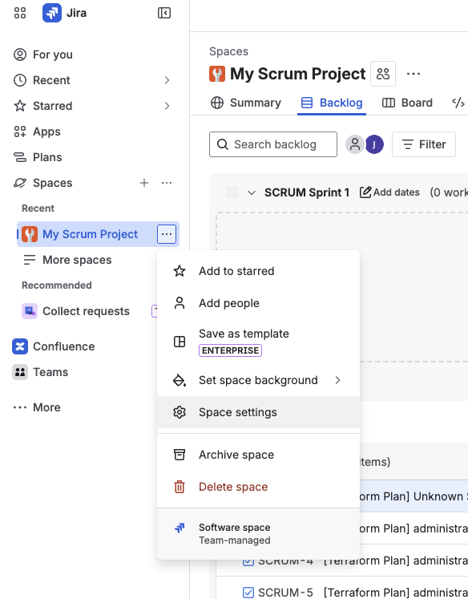
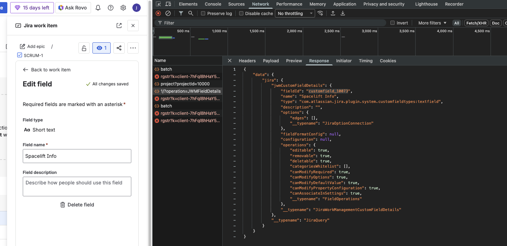
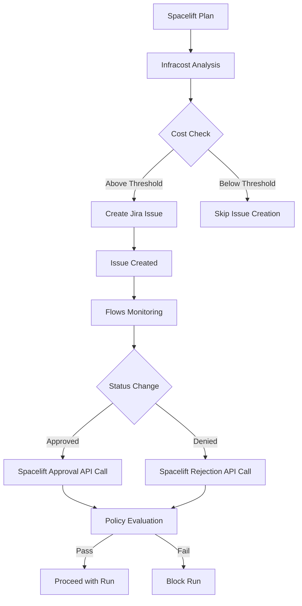

# Spacelift Jira Approval Plugin

A Spacelift plugin that automatically creates Jira issues for Terraform/OpenTofu plans when estimated infrastructure costs exceed a configurable threshold. The plugin integrates with Jira, Infracost, and Spacelift Flows to provide automated approval workflows based on infrastructure cost estimates.

## Demo

[](https://www.youtube.com/watch?v=iFG_Q1Rohyo)

## Features

- Automatic Jira issue creation for Terraform/OpenTofu plans
- Cost-based thresholds using Infracost integration
- Detailed plan summaries with resource change tracking
- Cost estimates with historical comparison
- Automated approval workflows via Spacelift Flows
- JWT-based webhook security for Jira integration
- Spacelift policy integration for cost control

## How It Works

1. After a Terraform/OpenTofu plan runs in Spacelift, the plugin generates a cost estimate using Infracost
2. If the estimated monthly cost exceeds the configured threshold, a Jira issue is created automatically
3. The Jira issue contains detailed information about planned changes, cost estimates, and a link back to the Spacelift run
4. A Spacelift Flow monitors the Jira issue for status changes
5. When the Jira issue is moved to an approved or denied status, the Flow automatically approves or rejects the Spacelift run
6. Spacelift policies enforce the approval requirements based on cost thresholds

## Prerequisites

- Spacelift account with plugin support
- Jira Cloud instance
- Spacelift Flows account
- Infracost API key
- OpenTofu or Terraform

## Quick Start

See the [example](./example/main.tf) directory for a complete working configuration.

```hcl
module "jira_approval" {
  source = "github.com/spacelift-solutions/plugin-jira-approval"

  stack_label          = "jira"
  signing_key          = var.signing_key
  spacelift_api_key_id = var.spacelift_api_key_id

  jira = {
    url             = "https://yourcompany.atlassian.net"
    email           = "your-email@company.com"
    api_token       = var.jira_api_token
    project_key     = "INFRA"
    custom_field_id = "customfield_10082"
  }

  infracost = {
    threshold = 100  # Dollar amount
    api_key   = var.infracost_api_key
  }

  flows = {
    project_id       = "your-flows-project-id"
    jira_app_id      = "your-jira-app-id"
    spacelift_app_id = "your-spacelift-app-id"
  }
}
```

## Setup Instructions

Complete these steps to configure the integration. These manual steps are required to collect IDs and credentials that cannot be automated.

### 1. Create a custom field in Jira

Create a field to store Spacelift stack information on Jira issues:
- Go to your project's `Space Settings`
- 
- In the left navbar, select `Fields`
- Click `Add Field` → `+ Create new field`
- Name: `Spacelift Info`
- Field Type: `Short Text`
- Click `Create Field`

### 2. Get the custom field ID from Jira

Find the internal field ID that Jira assigned to your custom field:
- Open any issue in your Jira project
- Right-click anywhere on the page and select `Inspect` to open DevTools
- In DevTools, go to the `Network` tab and clear the history (click the `⃠` button in the top left)
- Click the `edit` button on the `Spacelift Info` field you just created
- In the Network tab, you should see a request like `{number}/?operation={randomletters}` - click on it
- In the request details panel, go to the `Response` tab
- Copy the `fieldId` value from the JSON response
- 
- Save this value - you'll use it for `jira.custom_field_id` in the module config

### 3. Create a Flows project

Create a new project in Flows:
- After creating the project, copy the project ID from the URL (format: `0197b19a-cd01-7cf7-bc99-6699879cc49e`)
- Save this value - you'll use it for `flows.project_id` in the module config

### 4. Install the Jira app in Flows

Add the Jira Registry app to your Flows project:
- In your Flows project, go to the Apps section and add the `Jira` Registry app
- Follow the setup instructions in the app's `config` screen (shown on the right side)
- When creating the Jira Webhook, ensure `Issue Updated` is checked
- During setup, you'll create a Jira API token - save this for `jira.api_token` in the module config
- After installation, copy the app ID (visible in the app details) and save it for `flows.jira_app_id` in the module config

### 5. Install the Spacelift app in Flows

Add the Spacelift Registry app to your Flows project:
- In your Flows project, add the `Spacelift` Registry app from the Registry
- Copy the app ID and save it for `flows.spacelift_app_id` in the module config
- Save the api key id from spacelift for `spacelift_api_key_id` in the module config

### 6. Create an Infracost API key

Generate an API key for cost estimation:
- Go to [infracost.io](https://infracost.io) and create an API key
- Save this value - you'll use it for `infracost.api_key` in the module config

### 7. Create webhook signing secret

Create a secret to verify webhook authenticity:
- Generate a random string (e.g., using `openssl rand -hex 32`)
- In your Flows project, create a secret called `JIRA_WEBHOOK_SECRET` with this value
- Use the same value for `signing_key` in the module config

### 8. Create approval status secrets

Create secrets for Jira status transitions:
- In your Flows project, create a secret called `JIRA_APPROVED_STATUS` and set it to the status name you want for approved runs (e.g., `Done` or `Approved`)
- Create a secret called `JIRA_DENIED_STATUS` and set it to the status name you want for denied runs (e.g., `Rejected` or `Cancelled`)

### 9. Apply the OpenTofu module

Configure the module with all the values you collected above and apply it:
```bash
tofu apply
```

## Architecture

### Components

1. **Spacelift Plugin**: Runs after each plan to generate cost estimates and create Jira issues
2. **Jira Integration**: Stores plan details and cost estimates in structured issues
3. **Spacelift Flows**: Monitors Jira issues and triggers approval/rejection actions
4. **Spacelift Policies**: Enforces cost thresholds and approval requirements

### Data Flow



## Security

- Jira API tokens are stored securely in Spacelift as sensitive parameters
- Webhook requests are authenticated using JWT tokens signed with a shared secret
- The signing key should be a cryptographically secure random string
- All sensitive values should be stored in your Spacelift workspace as encrypted environment variables

## Customization

### Jira Issue Configuration

You can customize the Jira issues created by the plugin:

- `jira.issue_type`: The type of issue to create (default: "Task")
- `jira.assignee`: Account ID of the user to assign issues to
- `jira.labels`: Additional labels to add to issues (beyond the default "TF" and "spacelift" labels)
- `jira.initial_status`: Initial status for created issues

## Troubleshooting

### Jira issues not being created

1. Check that the Infracost threshold is set correctly
2. Verify that the Jira API token has permission to create issues in the project
3. Check Spacelift run logs for error messages from the plugin
4. Set SPACELIFT_DEBUG=true in your Spacelift stack to enable debug logging

### Flows not triggering approvals

1. Verify that the Jira webhook is configured correctly and includes "Issue Updated" events
2. Check that the `JIRA_APPROVED_STATUS` and `JIRA_DENIED_STATUS` secrets match your Jira workflow statuses exactly
3. Verify the signing key matches between Spacelift and Flows

### Cost estimates not appearing

1. Ensure Infracost is properly configured with a valid API key
2. Check that your Terraform/OpenTofu configuration includes resources with cost data in Infracost
3. Review the Spacelift run logs for Infracost execution errors

## Contributing

Contributions are welcome. Please open an issue or pull request with your suggested changes.

## License

This project is licensed under the MIT License - see the [LICENSE](LICENSE) file for details.

## Support

For issues and questions:
- File an issue in this repository
- Contact Spacelift support for Spacelift-specific issues
- Check the [Spacelift documentation](https://docs.spacelift.io) for plugin documentation
